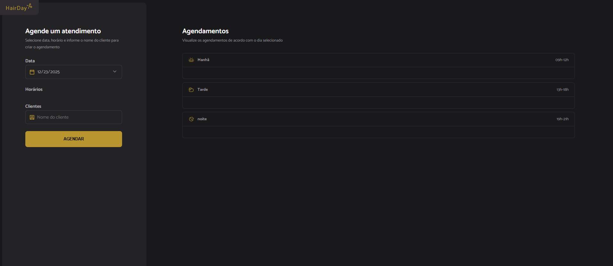
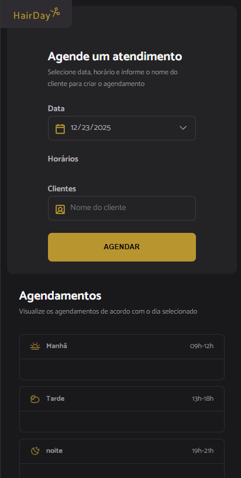

# ✂️ HairDay

Aplicação web para agendamento de cortes de cabelo. Permite selecionar uma data, escolher um horário disponível, cadastrar o nome do cliente, visualizar os agendamentos por período (manhã/tarde/noite) e cancelar agendamentos com confirmação. Interface responsiva, leve e focada em usabilidade.

## � Capturas de tela

<p align="center">
  
</p>
<p align="center">
  
</p>

## �🚀 Funcionalidades

- Seleção de data com bloqueio de datas passadas
- Lista de horários disponíveis em tempo real
- Criação de agendamentos com feedback de sucesso
- Visualização dos agendamentos por períodos (manhã, tarde, noite)
- Cancelamento de agendamentos com confirmação
- Persistência via API fake (`json-server`)
- Layout responsivo e estilização moderna

## 🧠 Como funciona

- Disponibilidade de horários é calculada com base nos agendamentos existentes e na data selecionada (`src/modules/form/hours-load.js`).
- Os agendamentos do dia são buscados da API e renderizados em seções de período (`src/modules/schedules/load.js`, `src/modules/schedules/show.js`).
- A criação e o cancelamento chamam a API com `POST` e `DELETE` respectivamente (`src/services/schedule-new.js`, `src/services/schedule-cancel.js`).
- Datas e horários são manipulados com `dayjs` já configurado para `pt-br` (`src/libs/dayjs.js`).

## 🛠️ Stack

- Front-end: HTML5, CSS3, JavaScript (ES6+), Day.js
- Build: Webpack, Babel
- API fake: JSON Server

## 📦 Instalação

```bash
npm install
```

## ▶️ Executando

Em dois terminais separados:

1. API (porta `3333`):

```bash
npm run server
```

2. Front-end (porta `3000` com live-reload):

```bash
npm run dev
```

A aplicação abrirá em `http://localhost:3000`. A API responde em `http://localhost:3333`.

## 🧪 Endpoints da API

- `GET /schedules` — lista todos os agendamentos
- `POST /schedules` — cria um agendamento
  - body: `{ id: string, name: string, when: string | Date }`
- `DELETE /schedules/:id` — cancela um agendamento

Fonte de dados: `server.json`.

## 🖥️ Uso

- Selecione a data no campo de calendário.
- Escolha um horário disponível (pastas e horários ocupados ficam indisponíveis).
- Informe o nome do cliente.
- Clique em `Agendar`. O agendamento aparecerá na lista do período correspondente.
- Para cancelar, clique no ícone de lixeira e confirme.

## 🗂️ Estrutura do projeto

```
HairDay/
├─ index.html
├─ server.json
├─ webpack.config.js
├─ package.json
├─ src/
│  ├─ assets/            # Ícones e imagens (SVG)
│  ├─ libs/dayjs.js      # Localização pt-br
│  ├─ modules/
│  │  ├─ page-load.js
│  │  ├─ form/
│  │  │  ├─ submit.js
│  │  │  ├─ date-change.js
│  │  │  ├─ hours-click.js
│  │  │  └─ hours-load.js
│  │  └─ schedules/
│  │     ├─ load.js
│  │     ├─ show.js
│  │     └─ cancel.js
│  ├─ services/
│  │  ├─ api-config.js
│  │  ├─ schedule-new.js
│  │  ├─ schedule-cancel.js
│  │  └─ schedule-fetch-by-day.js
│  ├─ styles/            # CSS global e páginas
│  ├─ utils/opening-hours.js
│  └─ main.js            # Entry do Webpack
└─ dist/                 # Build de produção
```

## 🧰 Build de produção

```bash
npm run build
```

Saída em `dist/` com `index.html`, `main.js` e assets copiados.

## ✅ Detalhes de UX

- Ícones e textos com `alt` e `aria-label` adequados.
- Estados visuais para disponibilidade e seleção de horário.
- Confirmação antes de ações destrutivas (cancelar).

## 🌐 Hospedagem

- Front-end publicado via GitHub Pages (branch `gh-pages`).
- API `json-server` hospedada no Render: `https://hairday-svxv.onrender.com`.
- Serviços gratuitos podem hibernar ou ter latência. A primeira requisição pode demorar alguns segundos; instabilidades podem ocorrer.
